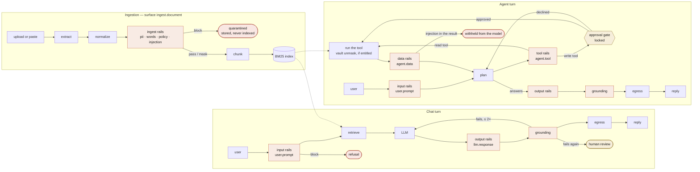

# What happens between a prompt and a reply

The complete path one message takes: keystroke → HTTP → the pipeline → HTTP → rendered
turn. Every box below is real code, and the file it lives in is named next to it.

Four ways to look at it:

| | |
|---|---|
| **[`index.html`](index.html)** → **/demo** | the architecture as swimlanes, with a **chat ↔ agent** toggle, a live runner, an ingestion panel, and the five scenarios. |
| **[`stages.html`](stages.html)** → **/demo/stages** | the chat request stage by stage, in depth, with a live trace overlaid. |
| **[`flow.py`](flow.py)** | the same stage chart in the terminal. `python demo/flow.py --sample injection` |
| **this file** | the reference diagrams and a written account of each stage. |

---

## Chat, agent, and ingestion



The two surfaces the agent adds are the point. `agent.tool` inspects the arguments the
model produced *before* the call runs; `agent.data` inspects what came back *before* the
model is allowed to read it. Neither exists in the chat path, and neither is optional:
`agent.tool_result_trust` is locked, because a tool result is attacker-reachable text.

---

## The five scenarios

Run them from `/demo`, or `POST /api/scenarios/{id}/run`. They drive the real engine and
assert on what came back.

| | Scenario | Surfaces | What it proves |
|---|---|---|---|
| simple | `clean` | prompt · retrieval · response | every rail runs and passes, and the answer is grounded |
| simple | `pii` | prompt · response | masking is not refusing — the model works on tokens |
| simple | `injection` | prompt | the pattern layer blocks before the model, and the refusal does not name the technique |
| **complex** | `poisoned-doc` | ingest · retrieval · agent.data | the same payload caught twice, on two different boundaries |
| **complex** | `agentic-claim` | prompt · agent.tool · agent.data · response | a vaulted identifier, a tool entitled to resolve it, and a write that waits for a person |

---

## The chat request, in full

```mermaid
flowchart TD

%% ─────────────────────────── BROWSER ───────────────────────────
subgraph BROWSER["Browser — web/scripts/"]
  direction TB
  B1["User types in the composer<br/><i>chat.js</i>"]
  B2{"Enter<br/>without Shift?"}
  B3["send()<br/>render user turn · 'running rails…' · lock composer"]
  B4["api.chat(text, sessionId)<br/>POST /api/chat<br/><i>api.js</i>"]
  B1 --> B2
  B2 -->|"no — newline"| B1
  B2 -->|yes| B3 --> B4
end

%% ─────────────────────────── SERVER ────────────────────────────
subgraph SERVER["FastAPI — server/"]
  direction TB
  S1["ChatRequest validation<br/>message 1–8000 chars · session_id ≤ 64<br/><i>routes/chat.py</i>"]
  S2{"engine ready?"}
  S3["503 startup / 500 config"]
  S4["state.history(session_id)<br/>last 12 turns<br/><i>state.py</i>"]
  S5["engine.converse(...)"]
  S1 --> S2
  S2 -->|no| S3
  S2 -->|yes| S4 --> S5
end
B4 --> S1

%% ─────────────────────────── ENGINE ────────────────────────────
subgraph ENGINE["Engine — guardrails/engine.py"]
  direction TB

  E1["<b>1 · Ingress</b><br/>session.bind · vault.open (AES-256-GCM)<br/>tracer opens, request_id minted"]
  E2["<b>2 · Normalize</b> — locked, never optional<br/>NFKC → strip invisibles → homoglyph fold → collapse spaces<br/><i>rails/normalize.py</i>"]

  E3["<b>3 · Prompt rails</b> — surface user.prompt<br/>every enabled rail runs concurrently under one 20s budget"]
  R1["words.lexicon<br/>Aho–Corasick, one pass"]
  R2["pii.detect<br/>regex → checksum gate → vault token"]
  R3["policy.rules<br/>security · privacy · compliance · use-case"]
  R4["prompt_attack<br/>pattern layer → Claude judge"]
  R5["content.safety<br/>Claude judge · 6 categories"]
  R6["pii.entities<br/>structural gate → Claude judge · names, addresses"]
  R7["scope.domain<br/>vocabulary → Claude judge"]

  E4["<b>4 · Policy decision</b><br/>precedence — block ▶ mask ▶ flag ▶ pass<br/>locked ordering"]
  A1{"any rail within<br/>adjudicator.margin<br/>of its threshold?"}
  A2["<b>4b · Close-call review</b><br/>Claude reads every rail result and rules<br/>raise freely · lower only above min_confidence,<br/>and never below flag<br/><i>agent/adjudicator.py</i>"]
  X1(["REFUSED<br/>audit.write · explain() at configured disclosure<br/>the model is never called"])

  E5["<b>5 · Retrieval</b><br/>BM25 over the index · top k=4, coverage ≥ 0.15<br/><i>ingest.py · Corpus.search()</i>"]
  E6["<b>6 · Retrieval rails</b> — surface retrieval<br/>scan what came back · mask it or drop it"]

  E7["<b>7 · Generation</b><br/>SYSTEM_PROMPT + CONTEXT[1..n] + masked QUESTION<br/>non-streaming · server-side fallback<br/><i>llm.py</i>"]
  X2(["MODEL REFUSAL<br/>stop_reason == refusal → REFUSAL_FALLBACK"])

  E8["<b>8 · Output rails</b> — surface llm.response<br/>words · pii · entities · policy · content"]
  E9["<b>9 · Grounding</b><br/>Claude judge → consistency ≥ 0.50 · relevance ≥ 0.35<br/><i>rails/grounding.py</i>"]

  D1{"output rail<br/>blocked?"}
  D2{"grounding<br/>failed?"}
  D3{"attempt ><br/>max_regenerations?"}
  X3(["REFUSED<br/>the failed draft is never shown"])
  X4(["HUMAN REVIEW<br/>REVIEW_TEMPLATE + request_id"])

  E10["<b>10 · Egress</b><br/>vault.unmask — decrypt tokens for the authorised caller<br/>audit.write — append-only, hash-chained"]
  E11["<b>11 · Review trigger</b><br/>policy.human_review.trigger consulted once, on every path"]

  E1 --> E2 --> E3
  E3 --> R1 & R2 & R3 & R4 & R5 & R6 & R7 --> E4
  E4 --> A1
  A1 -->|"no — almost every request"| V{{"final verdict"}}
  A1 -->|"yes — the narrow band"| A2 --> V
  V -->|block| X1
  V -->|"pass / mask / flag"| E5 --> E6 --> E7
  E7 -->|refusal| X2
  E7 --> E8 --> E9 --> D1
  D1 -->|"yes, and grounding was fine"| X3
  D1 -->|no| D2
  D2 -->|no| E10
  D2 -->|"yes · action_on_fail = regenerate"| D3
  D3 -->|"no — retry with a corrective turn"| E7
  D3 -->|yes| X4
  E10 --> E11
end
S5 --> E1

%% ─────────────────────────── RETURN ────────────────────────────
subgraph RETURN["Response"]
  direction TB
  T1["state.remember(...)<br/>a blocked turn is NOT remembered"]
  T2["state.record(trace) — ring of 50"]
  T3["JSON: reply · verdict · violations · detections · chunks · trace"]
  T4["addAssistant(data)<br/>verdict chip · masked count · regenerations · ms<br/><i>chat.js</i>"]
  T5["addTrace(trace) → Request trace view<br/><i>trace.js</i>"]
  T1 --> T2 --> T3 --> T4 --> T5
end
E11 --> T1
X1 --> T2
X2 --> T2
X3 --> T2
X4 --> T2

classDef stage  fill:#F8EBE4,stroke:#C15F3C,color:#1A1A18,stroke-width:1.5px
classDef rail   fill:#F5F3ED,stroke:#D3CFC2,color:#57564F
classDef stop   fill:#F9E7E3,stroke:#A63A29,color:#1A1A18
classDef review fill:#F6EEDA,stroke:#8A6A18,color:#1A1A18
class E1,E2,E3,E4,E5,E6,E7,E8,E9,E10,E11 stage
class R1,R2,R3,R4,R5 rail
class X1,X2,X3 stop
class X4 review
```



---

## Stage by stage

### 0 · Browser — `web/scripts/chat.js`

Enter submits, Shift+Enter inserts a newline. `send()` renders your turn immediately,
appends a pending `running rails…` node, and disables the composer — `busy` is a module
flag, so a second Enter during evaluation is dropped rather than queued. One
`POST /api/chat` carries `{message, session_id}`; the session id is minted once per page
load.

### 0.5 · Route — `server/routes/chat.py`

Pydantic rejects an empty or over-8000-character message before any rail runs. `_engine()`
turns a bad config into **500** and a not-yet-built engine into **503**, so a
misconfigured deployment fails at the door rather than half-way down the pipeline.

### 1 · Ingress

The tracer is created here, which is what mints `request_id`. Two rails record facts
rather than decide anything: `session.bind` (which session, which policy file) and
`vault.open` (whether AES-256-GCM is actually available — `cryptography` is an optional
import, and the trace says so either way).

### 2 · Normalize — `guardrails/rails/normalize.py`

NFKC → invisible-character strip → homoglyph fold → whitespace collapse, in that order,
because NFKC clears the easy cases and the homoglyph table only has to cover what it
leaves behind. **There is no config path to turn this off.** `words.normalization` is a
locked safety invariant: homoglyph substitution is the most common way a lexical filter
gets walked past, so an optional fold would make the filter optional.

Offsets are deliberately *not* preserved — the normalized text drives matching decisions,
while masking is applied to the original so you see your own message back.

### 3 · Prompt rails — `Surface.USER_PROMPT`

Every rail enabled for this surface is submitted to a `ThreadPoolExecutor` at once and
collected with a single `as_completed(timeout=policy.latency_budget_ms)`. Which rails run
is a severity-matrix question, not an if-statement: a cell set to `off` means the family
never reaches the pool for that surface.

| Rail | Engine | Action here | Notes |
|---|---|---|---|
| `words.lexicon` | Aho–Corasick, pure Python | `mask` | O(n + matches) in the *input*, independent of lexicon size. Blocklist runs first; the allowlist only exempts what it already caught. |
| `pii.detect` | regex + checksum + allowlist | `mask` | Luhn, Verhoeff, IBAN mod-97, SSA-range, PAN format. The checksum gate is locked on — it is what keeps precision high enough that nobody switches the rail off. `pii.allowlist` exempts published departmental contacts; see below. |
| `policy.rules` | named rule sets · regex | per rule | `pattern => block\|mask\|flag`; a rule with no action defaults to `flag`. |
| `prompt_attack` | pattern set → Claude judge | `block` | A pattern hit ≥ 0.85 short-circuits the judge entirely — that is most of what keeps median latency down. |
| `content.safety` | Claude judge · structured output | `block` | Six categories, each threshold scaled by the matrix cell (`high` = × 0.70). The judge sees one turn and no history: history is attacker-controlled. |
| `pii.entities` | structural gate → Claude judge | `mask` | Names and addresses, which no regex can find. A text with no capitalised candidate never reaches the model. Spans are checked against the text before masking — a span the model invented would rewrite the wrong characters. |
| `scope.domain` | vocabulary → Claude judge | `flag` | A configured domain term settles it at 0 ms; the judge is asked only when nothing matches, so an unusually phrased question is not turned away for its wording. |

Two failure modes are handled here and nowhere else:

- **A rail raises** → `policy.fail_mode`. `fail_closed` (the default) turns the exception
  into `BLOCK`. The `except` is deliberately broad — a bad regex used to escape the
  fail-mode contract and take the request down instead of failing closed.
- **The budget expires** → every unfinished rail is recorded as `BLOCK` regardless of
  `fail_mode`. `policy.timeout_behavior` is locked: an unevaluated request is not a safe
  request.

Masking is applied in rail order, so a second masking rail sees the first one's output.

#### Published contacts — `pii.allowlist`

To a regular expression, `grievances@municipal.gov.in` looks exactly like a citizen's
personal address. Masking both means the assistant can never answer "who do I write
to", which is most of what a public-services desk is for — so the exemption is
configuration rather than code.

Two properties make it defensible:

- **Matched against spans in the text, not against the detected value.** The phone
  recognizer slices `800 425 1969` out of a published `1800 425 1969`; a value-based
  rule could never match that fragment. The question is not "does this value look
  official" but "does this detection fall inside something the operator published".
- **Detection still happens.** An exempt contact is found, counted, and written to the
  audit entry — only the rewrite is skipped, and `pii.detect.meta.allowlisted` reports
  how many and which.

`pii.allowlist_ordering` is locked: detect → exempt → mask. An allowlist consulted
before detection would suppress the match itself, making an exemption indistinguishable
from a recognizer that quietly failed.

A citizen's own address matches none of the shipped entries and is masked exactly as
before — including when both appear in the same sentence.

### 4 · Policy decision

`precedence()` — `block ▶ mask ▶ flag ▶ pass`, most restrictive wins. Locked, because any
other ordering lets one permissive rail overrule a restrictive one.

**On `block` the request stops here.** The audit entry is written, `explain()` builds a
user-facing message at the configured disclosure level, and the model is never called.
`prompt_attack` explanations are capped at `category` no matter what disclosure is set to
— naming the matched technique teaches an attacker exactly which phrasing to vary next.

### 4b · Close-call review — `guardrails/agent/adjudicator.py`

A threshold is a hard line drawn through a soft judgement. `content.safety` at 0.42
against a 0.45 line passes; at 0.46 it blocks; nothing separates those two requests but a
rounding error. This is the one decision in the stack a model is allowed to revisit, and
it runs *only* on that band — when a scored rail lands within `adjudicator.margin` (0.08)
of its own threshold. On a score nowhere near its line, which is almost all traffic,
nothing here runs and nothing here costs anything.

What it may do is deliberately asymmetric:

| Direction | Rule | Why |
|---|---|---|
| **raise** | freely, up to `block`, no confidence required | judging a marginal request worse than it scored is the safe direction |
| **lower** | only for the rail that triggered it, only above `adjudicator.min_confidence`, and never below `flag` | a lowered block becomes a *recorded* turn rather than a refused one |

`adjudicator.downgrade_floor` is locked at `flag`. If a downgrade could reach `pass`, one
confident model call would erase an incident an operator never saw.

Two exclusions are locked as well. **Deterministic rails are never adjudicated** — a
pasted credential or a `drop table` matched or it did not, and a model permitted to
overrule a regex is a bypass, not nuance. **A rail that errored or timed out is never
adjudicated** — its verdict is a fail-closed default rather than a score, and softening it
would undo the fail-closed guarantee exactly when the stack is least healthy.

The ruling joins the rail results, not just the trace: a `block` it raised has to be able
to explain itself in the refusal, and `_refusal()` reads that list.

### 5 · Retrieval — `guardrails/ingest.py`

BM25 over every indexed chunk — the fifteen seed documents plus everything ingested — top
`k = grounding.context_window`, gated by term coverage at `ingest.min_chunk_score`. The
two numbers answer different questions: BM25 ranks, coverage decides whether any of it is
about the question at all. A weak match is worse than no match, because it gives the
grounding rail irrelevant context to score against.

Quarantined documents are not in the index, so retrieval cannot return them.

The seed corpus is small and incomplete **on purpose** — a knowledge base that covers
everything never produces an ungrounded answer, so it never exercises the rail.

Four of the fifteen carry contact details:

| Document | Why it is there |
|---|---|
| `grievance-escalation` | The escalation ladder, with the Deputy Commissioner's address and the published helpline |
| `office-directory` | Which wing handles which subject, and where to write |
| `appeal-deadlines` | Three different deadlines that all run from the letter date, not the receipt date |
| `identity-documents` | What counts as photo ID, and the note that staff never ask for an Aadhaar number by email |

They exist so that retrieval actually returns chunks containing personal data. Without
them the retrieval-surface rails ran on clean text every time and were never really
tested — and the `pii.allowlist` distinction above has nowhere to show itself.

**Built-ins reach deployments that already exist.** The store records which built-in
documents it has ever been given, so a shipped corpus update tops up an existing
`data/corpus.json` without touching uploads. Tracked by id rather than by presence, so a
built-in an operator deleted on purpose stays deleted instead of returning at every
restart.

### 6 · Retrieval rails — `Surface.RETRIEVAL`

Retrieved text is untrusted input too. If it comes back blocked the chunks are dropped and
generation continues without them; if it comes back masked, the masked chunks are what the
model sees.

### 7 · Generation — `guardrails/llm.py`

`SYSTEM_PROMPT` + conversation history + a user turn shaped as numbered `CONTEXT` followed
by the **masked** `QUESTION`. The system prompt tells the model that tokens like
`<US_SSN:a1b2c3>` are expected and not to ask the user to repeat them.

Non-streaming, on purpose: an output rail needs the complete response before anything
reaches the user, and a grounding check cannot score a sentence that has not finished.
Streaming and inline output rails are mutually exclusive; this stack picks the rails.

`stop_reason == "refusal"` is checked **before** reading content and raised as `Refusal` —
a content outcome, not an API error.

### 8 · Output rails — `Surface.LLM_RESPONSE`

The same families run again on the way out, at that surface's severity. `prompt_attack`
does not — it is scoped to inbound surfaces. `content.action.llm_response` is
`regenerate`, which the rail reports as `BLOCK` and the *engine* interprets as a retry:
`regenerate` is a stage-level action, never a rail verdict.

### 9 · Grounding — `guardrails/rails/grounding.py`

A Claude judge scores the answer against the chunks that were actually retrieved, on two
deliberately separate numbers:

- **consistency** ≥ 0.50 — is every claim supported by the context?
- **relevance** ≥ 0.35 — does it answer the question that was asked?

They fail differently. A confidently wrong answer is low-consistency, high-relevance; a
correct but evasive answer is the reverse. Averaging them into one "quality" score hides
both. With no retrieved context the rail no-ops rather than inventing a baseline —
grounding is architecturally scoped to retrieval-backed responses.

### 9.5 · The three exits from the output loop

| Condition | What happens |
|---|---|
| Output rail blocked, grounding fine | Refusal. The draft is never shown. |
| Grounding failed, attempts remain | Back to **7** with a corrective instruction appended. `trace.regenerations` increments. |
| Grounding failed, `max_regenerations` exhausted | Human review queue. The user gets `REVIEW_TEMPLATE` and a request id. |

A failed output rail returns to the model, never to the user. Only a second failure
surfaces a person.

### 10 · Egress

`vault.unmask` walks the reply for `<ENTITY:token …tail>` and decrypts each one back to the
original value — for an authorised caller only, and only when `pii.reversible` is on. That
is the whole point of vault tokens: the model never saw the raw SSN, and the user still
gets their own data back.

Then `audit.write` — one JSON line committing to the hash of the previous entry. Editing or
deleting any entry breaks verification from that point on (`GET /api/audit/verify`).

### 11 · Review trigger

`policy.human_review.trigger` is consulted **once**, in `converse()`, after `_converse()`
has returned by whichever of its exits it took — including the blocked ones, since a block
is often exactly what a reviewer needs to see. Deciding it here rather than at each return
site means a new exit path cannot forget to consult it.

`sampled 5%` is derived from the request id rather than an RNG, so a trace replayed later
lands in the queue the same way it did in production.

### 12 · Back in the browser

A blocked turn is **not** written to conversation history — a refused prompt must not
become context for the next one. The trace joins a 50-entry ring buffer, the JSON comes
back, and `addAssistant()` renders the verdict chip, the masked-value count, any
regenerations, and total-vs-rail milliseconds. "View trace" opens the full stage tree.

---

## What the four sample prompts exercise

| Sample | Path taken |
|---|---|
| **A clean request** | Every stage, no branch. `pass` at 4, grounded at 9, delivered. |
| **PII in the prompt** | `pii.detect` masks to vault tokens at 3 → verdict `mask`, not a block → the model sees `<US_SSN:…>` → **10** decrypts on the way out. |
| **Prompt injection** | Pattern layer scores 0.95 ≥ 0.85, judge short-circuited, `block` at 4. Stages 5–10 never run. |
| **Not in the corpus** | Generation reaches for a figure the corpus lacks → **9** fails consistency → **7** again → delivered on the retry, or escalated to review if it reaches again. |

## Running it

```bash
python run.py                       # console, with this chart at /demo
python demo/flow.py                 # terminal chart, live trace overlaid
python demo/flow.py --sample pii    # clean | pii | injection | ungrounded
python demo/flow.py --ask "..."     # your own prompt
```
